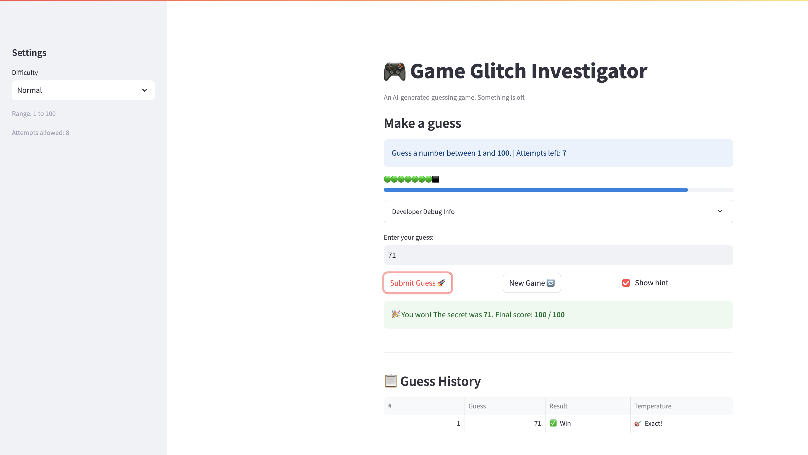
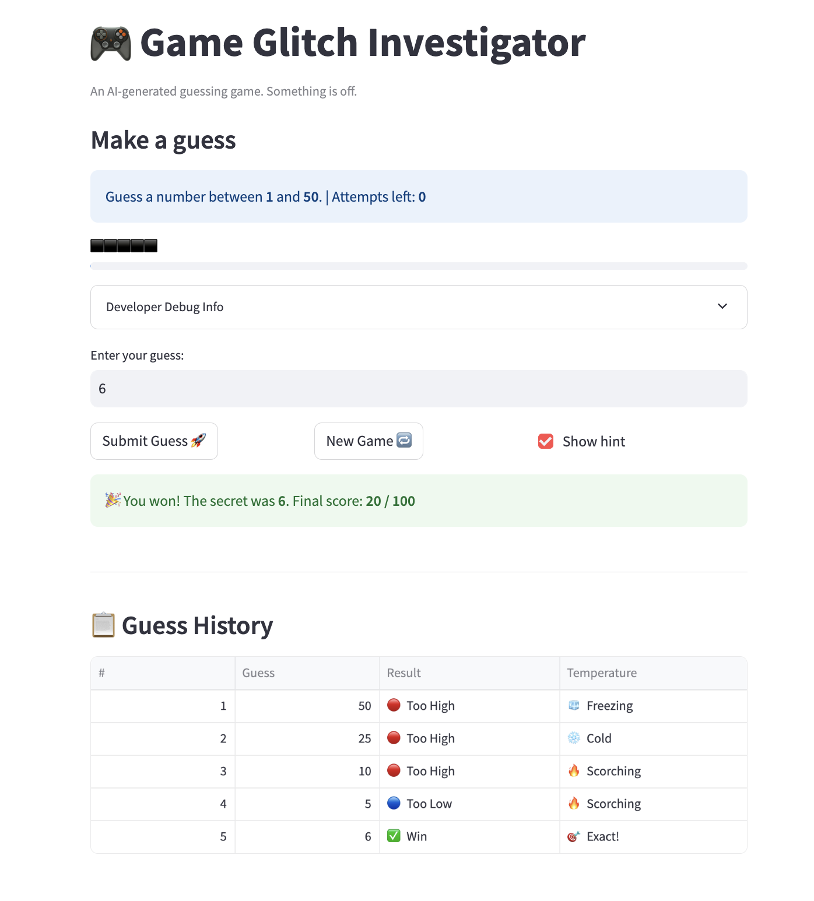

# 🎮 Game Glitch Investigator: The Impossible Guesser

## 🚨 The Situation

You asked an AI to build a simple "Number Guessing Game" using Streamlit.
It wrote the code, ran away, and now the game is unplayable. 

- You can't win.
- The hints lie to you.
- The secret number seems to have commitment issues.

## 🛠️ Setup

1. Install dependencies: `pip install -r requirements.txt`
2. Run the broken app: `python -m streamlit run app.py`

## 🕵️‍♂️ Your Mission

1. **Play the game.** Open the "Developer Debug Info" tab in the app to see the secret number. Try to win.
2. **Find the State Bug.** Why does the secret number change every time you click "Submit"? Ask ChatGPT: *"How do I keep a variable from resetting in Streamlit when I click a button?"*
3. **Fix the Logic.** The hints ("Higher/Lower") are wrong. Fix them.
4. **Refactor & Test.** - Move the logic into `logic_utils.py`.
   - Run `pytest` in your terminal.
   - Keep fixing until all tests pass!

## 📝 Document Your Experience

### Game Purpose

Game Glitch Investigator is a number guessing game built with Streamlit. The player selects a difficulty level (Easy, Normal, or Hard), each of which sets a numeric range and a limited number of attempts. The game picks a secret number within that range, and the player tries to guess it. After each guess, the game gives a directional hint — "Go HIGHER" or "Go LOWER" — to guide the next guess. The final score (0–100) is based on how quickly the player guesses correctly: fewer attempts used means a higher score.

### Bugs Found

1. **Hints were reversed** — guessing too high told the player to go higher, and guessing too low told them to go lower, making the game unwinnable by following the hints.
2. **Secret number reset on every submit** — the secret was not stored in session state, so it regenerated on every Streamlit rerun (every button click), making it impossible to win.
3. **New game button did not work** — clicking "New Game" did not reset the game state properly because `st.rerun()` was not called, so the game stayed frozen.
4. **Score did not reset on new game or difficulty switch** — the score carried over between games instead of restarting at 0.
5. **Secret number did not reset when switching difficulty** — switching from Normal to Easy could leave a secret number (e.g. 87) that was outside the Easy range (1–20).
6. **Scoring system was broken** — wrong guesses on even attempts rewarded +5 points, Too High and Too Low were penalized asymmetrically, and the win formula had an off-by-one that double-penalized the first attempt.

### Fixes Applied

1. **Reversed the hint logic** in `check_guess()` so "Go HIGHER" fires when the guess is too low and "Go LOWER" fires when the guess is too high.
2. **Moved secret number into `st.session_state`** so it persists across reruns and only changes when a new game is explicitly started.
3. **Fixed the New Game button** by adding `st.rerun()` after resetting session state so the UI refreshes immediately.
4. **Added `st.session_state.score = 0`** to both the new-game block and the difficulty-switch block so the score resets at the start of every new match.
5. **Added secret re-generation on difficulty switch** — when the player changes difficulty, a new secret is picked within the correct range for that difficulty.
6. **Redesigned the scoring system** — score is now match-based (0–100). Winning on the first attempt gives 100 points; each additional attempt used deducts an equal share (`100 / attempt_limit`). Losing gives 0. The direction of a wrong guess no longer affects the score.

## 📸 Demo

## 🚀 Stretch Features

### Enhanced Game UI

The following UI enhancements were added on top of the core game logic:

- **Color-coded hints** — "Too High" displays in red (`st.error`) and "Too Low" in blue (`st.info`) so the player can immediately tell direction at a glance without reading the text.
- **Hot/Cold temperature indicator** — every guess is rated based on how close it is to the secret number as a fraction of the difficulty range. Labels range from 🧊 Freezing (far away) to 🔥 Scorching and 🎯 Exact! (very close or correct). The temperature appears inline with the hint.
- **Attempts remaining progress bar** — a row of 🟢 dots drains to ⬛ as attempts are used, giving the player a quick visual sense of urgency without counting numbers.
- **Guess history summary table** — a `📋 Guess History` table appears after the first guess, showing every attempt in order with columns for guess value, result icon (✅ / 🔴 / 🔵), and temperature. In the screenshot above, the player narrowed down from 50 → 25 → 10 → 5 → 6 (Win) with the temperature column clearly showing the progression from Freezing to Exact.
